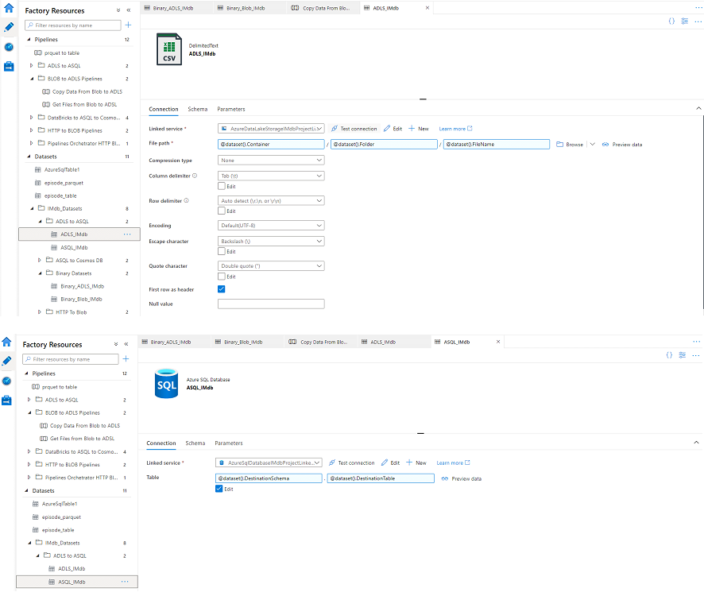
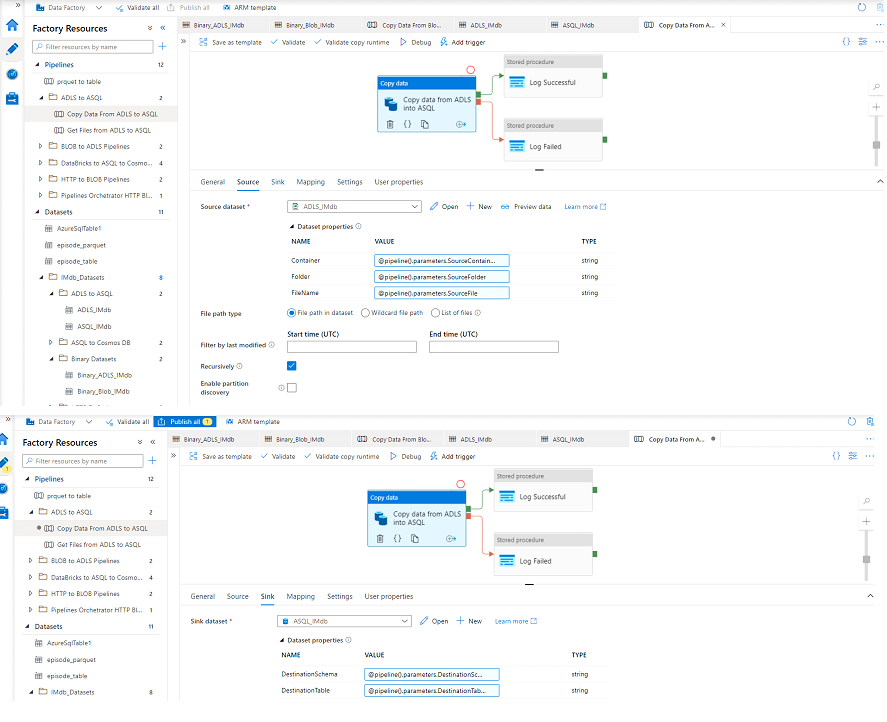

# Copy data from Azure Data Lake Storage (ADLS) to Azure SQL Database

The same principle is followed as described in section [Ingest data from HTTP service into Azure Blob Storage (ABS) with parametrized pipelines using Azure Data Factory (ADF)](Sections/HTTPToBlob.md).

There are  2 main diferences which have to be taken into consideration:
1. Datasets and linkedservices are different then used in [linked article](Sections/HTTPToBlob.md)
2. Parameter values are set according to Source and Sink in copy activity. We are using parameters definition from Sql Database under pipelineId = 3

The principle of execution flow is completely the same as from [linked article](Sections/HTTPToBlob.md) so we are not going into implementation details. As previously mentioned linked services and datasets are different and the same looks as on following image:

\
\

Also, Copy activity reflects set up of copy files from Blob to ADLS (Source and Sink are adjusted).

\
\

## Next
* [Create Databricks Notebooks for data transformation](Sections/CreateDBricksNoteBook.md)
