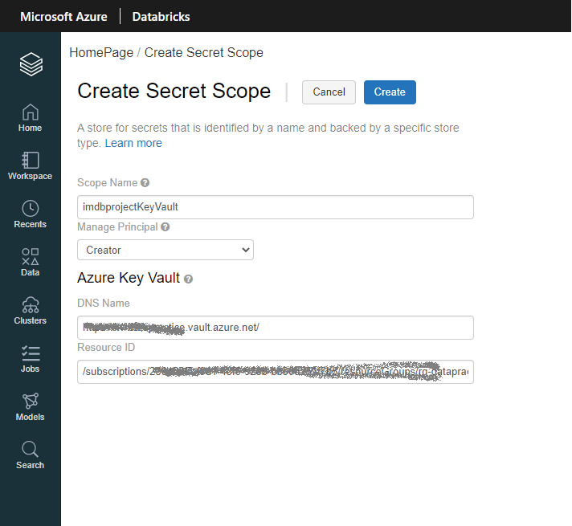

# Create Databricks Notebooks for data transformation

To access resources secured by an Azure AD tenant , a security principal must represent the entity that requires access. A security principal defines the access policy and permissions for a user or an application in the Azure AD tenant.
To see more details about how to create this please see [this section]().

In order to mount ADLS from Databricks :
1. Create an Azure Key Vault-backed Secret Scope in Azure Databricks
* Go to Databricks url and add #secrets/createScope at the end (new user form is open). Populate user form as folows:

\
\


***Important**: We use Python programming language to manage this notebook*

2. **Mount ADLS to Databricks using Secret Scope**
```
#Connect to ADLS
# Connection String Variables
adlsAccountName = "adlsimdbproject"
adlsContainerName = "exportedfiles-imdbproject"
adlsFolderName = "ExportedFiles"
mountPoint = "/mnt/csvFiles"

# Client ID - from Azure Key Vault using Secret Scope
applicationId = dbutils.secrets.get(scope="imdbprojectKeyVault",key="ClientId")

# Application (Client) - - from Azure Key Vault using Secret Scope
authenticationKey = dbutils.secrets.get(scope="imdbprojectKeyVault",key="ClientSecret")

# Directory (Tenant) ID - - from Azure Key Vault using Secret Scope
tenandId = dbutils.secrets.get(scope="imdbprojectKeyVault",key="TenatId")

# Dynamic End Point to ADLS-u
endpoint = "https://login.microsoftonline.com/" + tenandId + "/oauth2/token"
source = "abfss://" + adlsContainerName + "@" + adlsAccountName + ".dfs.core.windows.net/" + adlsFolderName

# Connect using Service Principal secrets and OAuth
configs = {"fs.azure.account.auth.type": "OAuth",
           "fs.azure.account.oauth.provider.type": "org.apache.hadoop.fs.azurebfs.oauth2.ClientCredsTokenProvider",
           "fs.azure.account.oauth2.client.id": applicationId,
           "fs.azure.account.oauth2.client.secret": authenticationKey,
           "fs.azure.account.oauth2.client.endpoint": endpoint}

# Mounting ADLS Storage => DBFS
 
if not any(mount.mountPoint == mountPoint for mount in dbutils.fs.mounts()):
  dbutils.fs.mount(
    source = source,
    mount_point = mountPoint,
    extra_configs = configs)

```

3. **Do the transformation**

**Notification** *Each grey section represents separate cell within Databricks Notebook*

2 transformations are applied:
* Joining 2 dataframes and splitting the column with array data type (loaded in SQL Database)
* Clearing null values in dataframe and saving as parquet file

```

# reference import

from pyspark.sql import SQLContext
from pyspark.sql.functions import explode
from pyspark.sql.types import *
from pyspark.sql.functions import col, split, concat_ws
from pyspark.sql import functions as sf
from pyspark import SparkConf, SparkContext
from pyspark.sql import SparkSession

```

```


# **Create dataframes from 2 tsv files**

dfBasics = spark.read.csv("/mnt/csvFiles/Basics.csv", sep=r'\t', header=True).select('tconst','titleType','primaryTitle','originalTitle','isAdult','startYear','endYear','runtimeMinutes','genres')
dfRatings = spark.read.csv("/mnt/csvFiles/Ratings.csv", sep=r'\t', header=True).select('tconst','averageRating','numVotes')

df = (dfBasics.alias('dfBasics').join(dfRatings.alias('dfRatings'),
                               on = dfBasics['tconst'] == dfRatings['tconst'],
                               how = 'inner')
                         .select('dfBasics.*',
                                 'dfRatings.averageRating')
)


# start transform
df2 = df.withColumn("genres", split(col("genres"), ",").cast("array<string>"))

# explosion in dataset - transform comma separated velues in columns in rows
df3 = df2.withColumn("originalGenres",explode(df2.genres))
df4 = df3.withColumn('webLocation', sf.concat(sf.lit('https://www.imdb.com/title'),sf.lit('/'), sf.col('tconst')))
df4.show()

```

```

userName = dbutils.secrets.get(scope="imdbprojectKeyVault",key="userName")
passWord = dbutils.secrets.get(scope="imdbprojectKeyVault",key="passWord")
jdbcUrl = dbutils.secrets.get(scope="imdbprojectKeyVault",key="jdbcUrl")

# "jdbc:sqlserver://imdbdatabaseserver.database.windows.net:1433;database=IMdbDataBase"

# return array in column data type 
df4.withColumn('genres', concat_ws(',', 'genres')).write \
    .format("jdbc") \
    .mode("overwrite") \
    .option("url", jdbcUrl ) \
    .option("dbtable", "dbo.RatedMovies") \
    .option("user", userName) \
    .option("password", passWord) \
    .save()
```

4. **Unmount storage**

```

# Unmount 
if any(mount.mountPoint == mountPoint for mount in dbutils.fs.mounts()):
  dbutils.fs.unmount(mountPoint)
  ```

Also, another notebook added - transforming the file and saving in parquet format for further use. Since mount is the same as for previous example it will be escaped - only transformation is shown:

5. **Get data**
```
df_episode = spark.read.csv("/mnt/csvFiles/Episode.csv", sep=r'\t', header=True)
```
6. **Transform the data**
```
from pyspark.sql.functions import *
from pyspark.sql.functions import when, lit, col

def replace(column, value):
    return when(column != value, column).otherwise(lit(None))

df_episode = df_episode.withColumn("seasonNumber", replace(col("seasonNumber"), "\\N"))
df_episode = df_episode.withColumn("episodeNumber", replace(col("episodeNumber"), "\\N"))

```
7. **Clear Null Values**
```
# remove null values
df_episode = df_episode.dropna()
print(df_episode.count())

```

8. **Save to ADLS in parquet format**
```
df_episode.write.mode("append").parquet("/mnt/parquet/episode")
```

### **Important:** *Both notebooks can be found [here](/DatabricksNotebooks).*