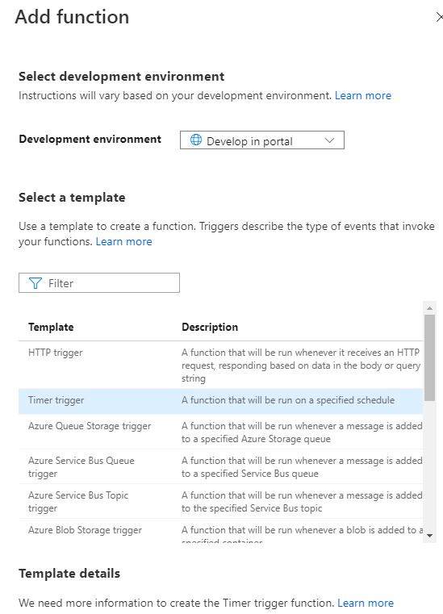

## Use Azure Function and C# for fetching and loading data into Azure Storage Acocunt from Azure SQL Database

Purpose of this section is to show another option in moving data from one location to another.In this case we use Azure Function and C# script to connect to Azure SQL Database , fetch the data and move the same into Azure Blob Storage.

We often build systems to react to a series of critical events. Whether you're building a web API, responding to database changes, processing IoT data streams, or even managing message queues - every application needs a way to run some code as these events occur.\

In project we run function as scheduled tasks - actually we execute code at set time. There are many other scenarios - for more info plese see Microsoft Docs pages.\

As for set time please visit [this page](https://docs.microsoft.com/en-us/azure/azure-functions/functions-bindings-timer?tabs=csharp) for more details.

To create Azure function, first you need to create Function App:

1. Search for **Function App** in resources and click on **Create** and fill required parameters (function name in first place). Also, the importan one for our project is **Runtime Stack** -  set to **.NET** and leave Azure to populate rest of required fields.
2. When Function App is created go to **Functions** on left sidebar blade and click on **+Add**
3. Select **Time Trigger** and click on **Add** - see image
\
\

4. After Function is created go to **Integration** blade on leftside bar and click on **+Add Output**
5. Set output parameters (leave outputBlob as default for blop parameter name)
6. After output is defined clisk on **Code + Test** balde on leftside bar and paste following C# script

```
using System;
using System.Data;
using System.Configuration;
using System.Data.SqlClient;

public static void Run(TimerInfo myTimer, ILogger log, TextWriter outputBlob )
{
    string constr = Environment.GetEnvironmentVariable("SqlServerConnString");
        using (SqlConnection con = new SqlConnection(constr))
    {
        using (SqlCommand cmd = new SqlCommand("select top 10 tconst from stage.movies where titleType ='tvmovie'"))
        {
            using (SqlDataAdapter sda = new SqlDataAdapter())
            {
                cmd.Connection = con;
                sda.SelectCommand = cmd;
                using (DataTable dt = new DataTable())
                {
                    sda.Fill(dt);
 
                    //Build the CSV file data as a Comma separated string.
                    string csv = string.Empty;
 
                    foreach (DataColumn column in dt.Columns)
                    {
                        //Add the Header row for CSV file.
                        csv += column.ColumnName + ',';
                    }
 
                    //Add new line.
                    csv += "\r\n";
 
                    foreach (DataRow row in dt.Rows)
                    {
                        foreach (DataColumn column in dt.Columns)
                        {
                            //Add the Data rows.
                            csv += row[column.ColumnName].ToString().Replace(",", ";") + ',';
                        }
 
                        //Add new line.
                        csv += "\r\n";
                    }

                    outputBlob.Write(csv.ToString());
                }
            }
        }
    }

                
}


```


