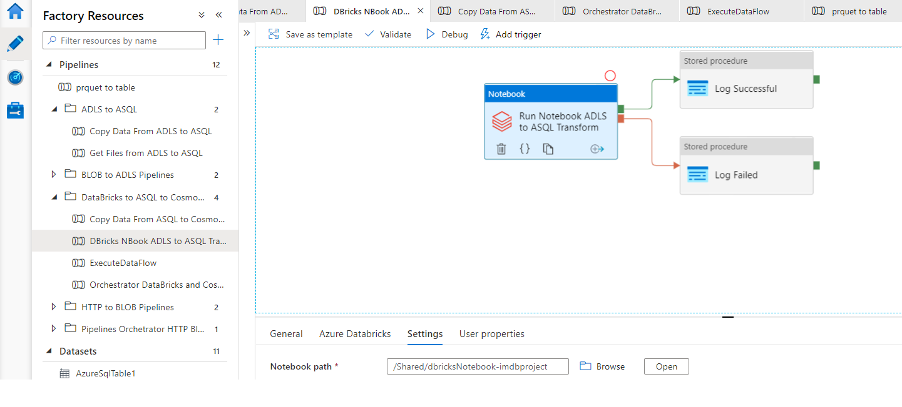
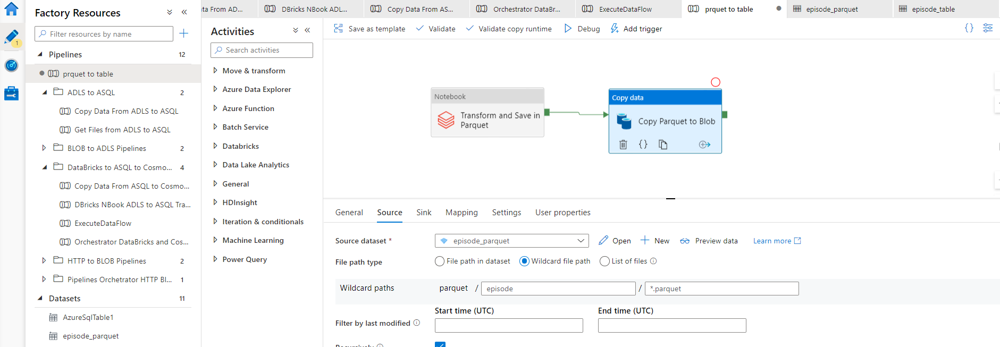

# Transform data using Databricks Notebook Activity in Azure Data Factory (ADF) and load into Azure Data Lake Storage (ADLS) and Azure SQL Database

Here we only going to show how to set up pipeline in Azure Data Factory to run Databricks Notebook.

1.  Linked Service to DataBrisck must be created, as well as Dataset (we don't go into details)
2.  Notebook Activity is selected and set up to run the Databricks Notebook as follows:

\
\

3.  In order to run Notebook to save dataframe in parquet format and then move to Blob storage pipeline is created as follows:

\
\

It's not purpose to go in implementation details just to show how easy is to run Databricks NOtebook using ADF in order to do transformation and loading data into different data storages.

