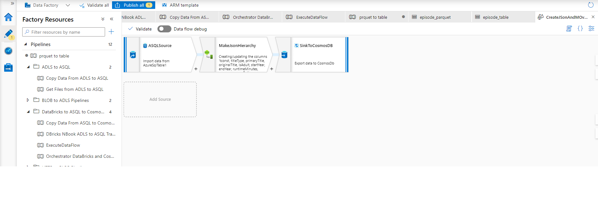
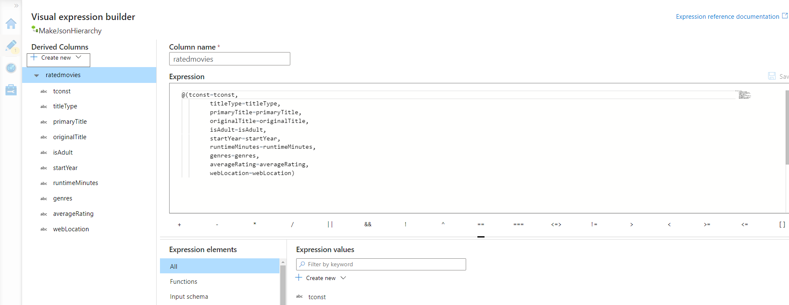
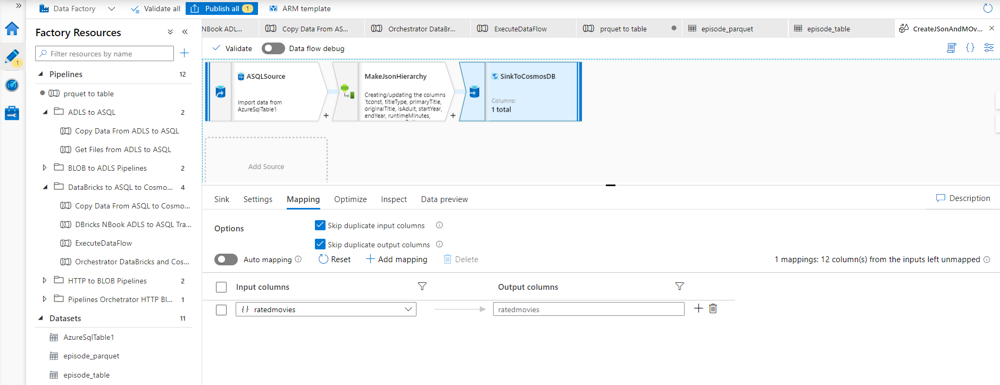
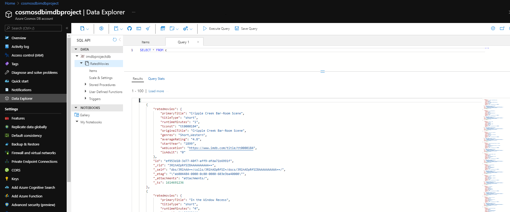

# Transform data using Data Flows in Azure Data Factory (ADF) and load from Azure SQL Database into CosmosDb

Before load into Cosmos DB data have to be prepared in Json format. It means that if extract from tabular format (Azure SQL Database) transformation logic need to be applied in sub-step of data flow between source and destination so data are adjusted to Json structure.\
Unfortunatelly, it's not staright forward process even thought SQL Database integrate functions for working with json file format data.  The solution is to use Data Flow in Azure Data Factory to do the transformation in between.\
\
Data Flow is a feature of Azure Data Factory (ADF) that allows you to develop graphical data transformation logic that can be executed as activities within ADF pipelines.

The one needed for our project purpose is not the complex one. The aim is to mapp all extracted columns into one hierarchy view representing Json structure. To achieve this, Mapping data flows has a dedicated experience aimed to aid you in building these expressions called the Expression Builder.

The following steps need to be done in Dataflow to make this data movement with transformation in between:

1.  Create Source (reffering to Azure SQL Database)
2.  Create transformation out of Source
3.  Load into Cosmos DB (Sink - Cosmos DB)

The following image shows flow as previously defined:

\
\

2. As already mentioned, most important part of the flow is mid-transformation of data into Json structure.  Here you can see how it's mapped into ratedmovies{} hierarchy which is then mapped and passed into Cosmos DB.
\
\

\
\
The following image show the mapping to CosmosDB based on transformed hierarchy:

3. The final result (data loaded into Cosmos DB after executin of Data flow) is shown on following image:
\
\

