# Ingest data from HTTP service into Azure Blob Storage (ABS) with parametrized pipelines using Azure Data Factory (ADF)

Several steps need to be implemented in order to make this working. 

1.  **Create Linked Services to HTTP and Blob storage**. Those are 2 separate services as shown on image below:\
\
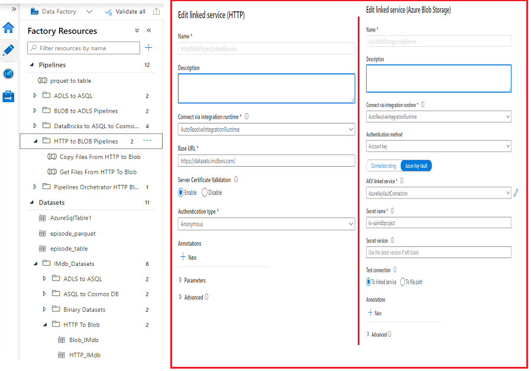

2.  **Create Datasets to HTTP and Azure Blob Storage (as shown on images below)**.\
\
Those are parametrized datasets. Creating hardcoded datasets and pipelines is not a bad thing in itself. It’s only when you start creating many similar hardcoded resources that things get tedious and time-consuming. Not to mention, the risk of manual errors goes drastically up when you feel like you create the same resource over again. 
\
\
This project apply dynamic solutions - solution reuse patterns to reduce development time and lower the risk of errors.\
\
Parameters are used to pass external values into pipelines and  datasets. Once the parameter has been passed into the resource, it cannot be changed. By parameterizing resources, you can reuse them with different values each time.\
\
Instead of hardcoding the file name from IMDB database in each dataset, we can parameterize the file name value. Then, we can pass the file name in as a parameter each time we use the dataset (it is paseed as dynamic content into Relative URL field in dataset).\
\
For this project we use Azure SQL Database to store parameters we pass into pipeline. 
\
It's good aproach since for every new dataset need to be introduces in project the only requirement is to add the same in parameters table instead of adjusting pipeline itself. In order to initially fill the parameters table in SQL Database run this [script](). The final table content should look as follows:
\
\
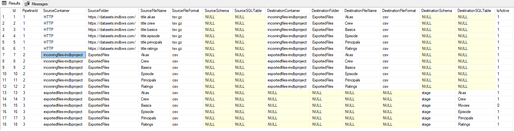
\
Now back to Datasets! In addition see images showing set up of dataset :
* **HTTP Dataset**
\
\
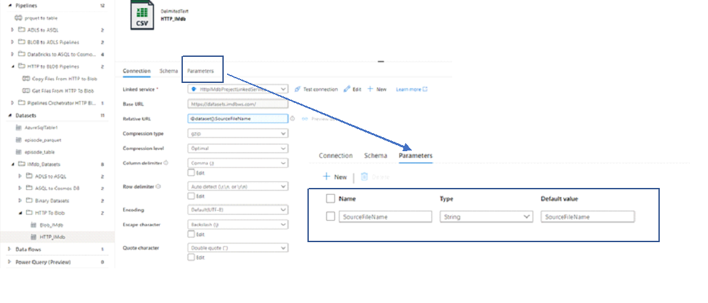
\
**Blob Storage Dataset**
\
\
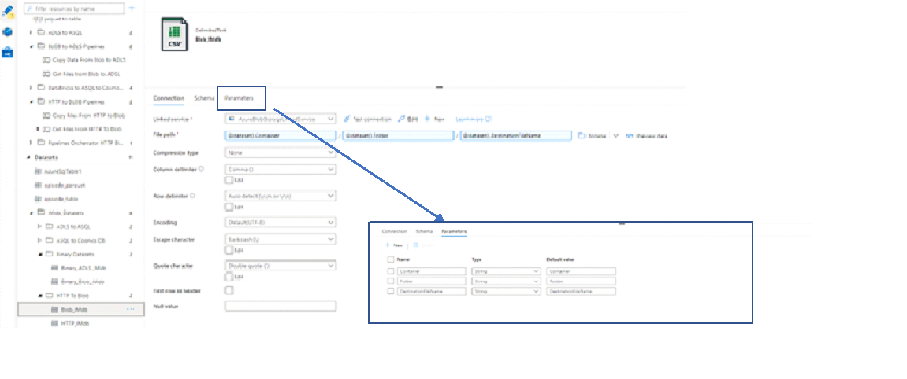

3. **Create pipeline for geting parameter values and pass into Copy activity (HTTP - Blob)**

There are 3 activities in this initial phase of fetching data:
* **Lookup Activity** to connect to SQL Database and fetch parameters
* **Filter Activity** - filter only Active activities (only that need to be executed and flaged with 1)
* Pass parameters into **ForEach** activity and start executing pipeline containing **Copy Activity** to move files from HTTP to Blob storage

**Lookup Activity**
\
\
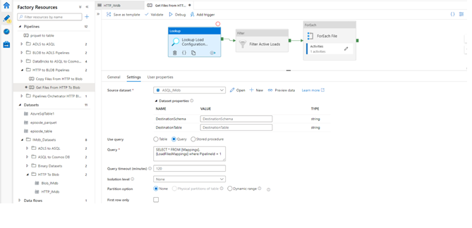\
\
**Filter Activity**
\
\
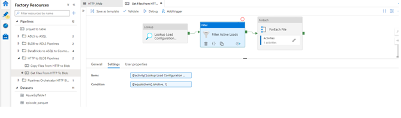\
\
**ForeEach Activity**
\
\
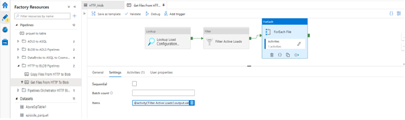\
\
**Get Files from HTTP to Blob** paipeline
\
\
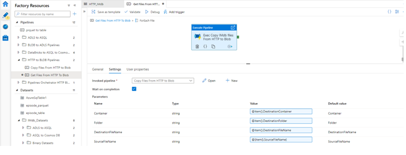\
\
Execute pipeline activity is used to pass parameter values used in Copy Activity. All 4 parameter fields are referencing parameters from ForEach activity. The same pipeline will be executed as many times as ForEach activity contains parameters in itself.
This way we reuse the patern and Copy activity to execute fetching all datasets from IMDB database and storing into Azure Blob Storage.

\
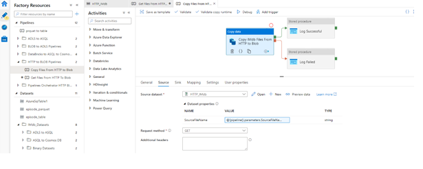

4. At the end of Copy Activity we log execution. On success we call Log Successful Activity and log the status into Azure Sql Database. The same is for Log Failed activity but the same is executed on Fail of Copy Activity.
See [Log Successful]() or [Log Failed]() procedures and their definition.

\
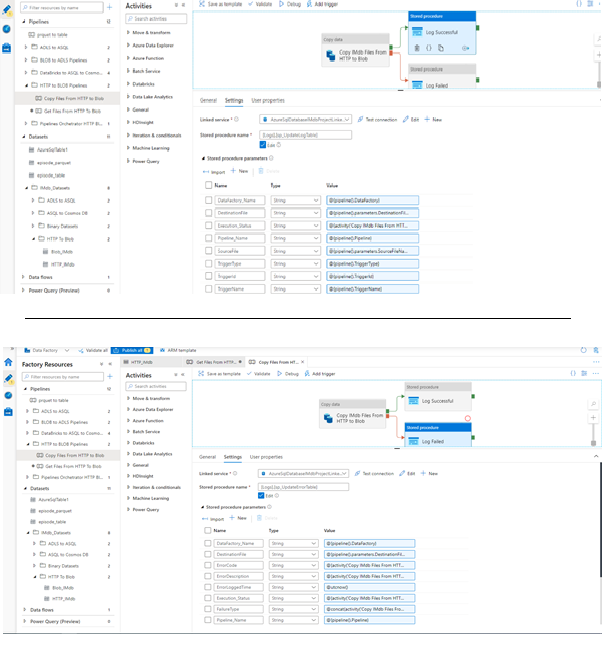

Finally, you can review log execution or even monitor execution this was using SSMS. In addition, execution Logger is shown both for Successful and Failed.

Successfuly Executed Activities
\
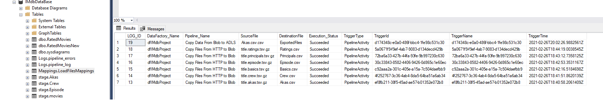

Failed Executed Activities
\
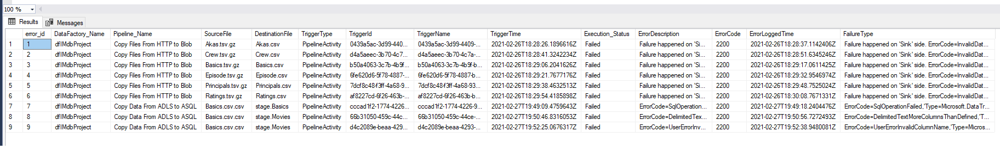
