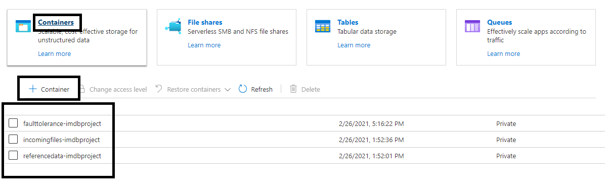
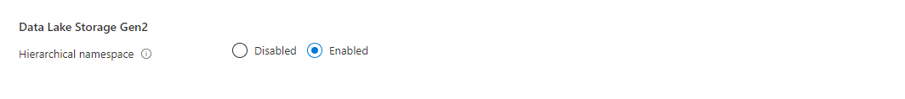
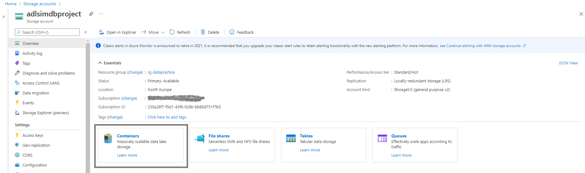
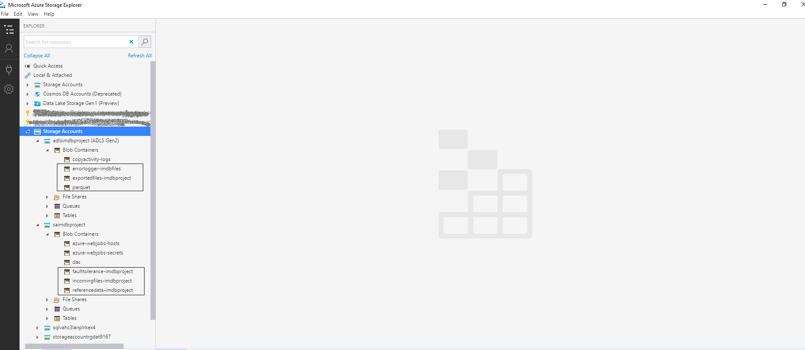
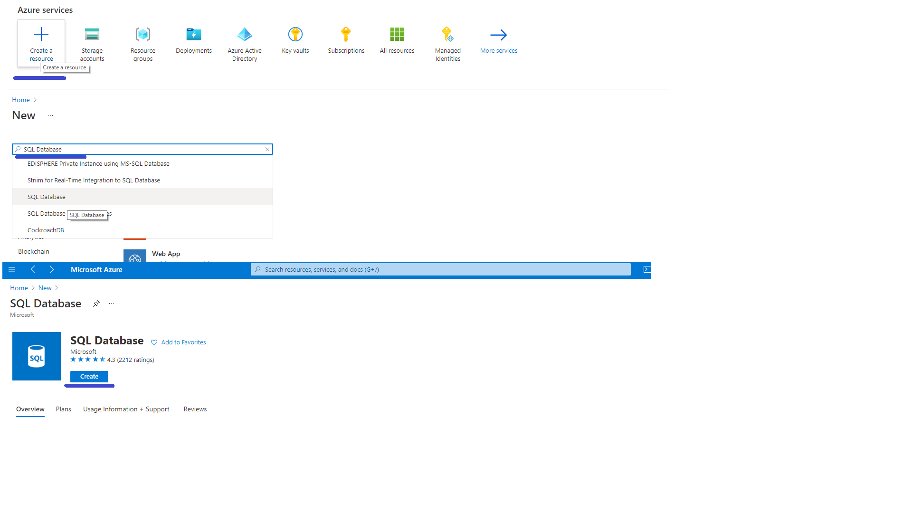
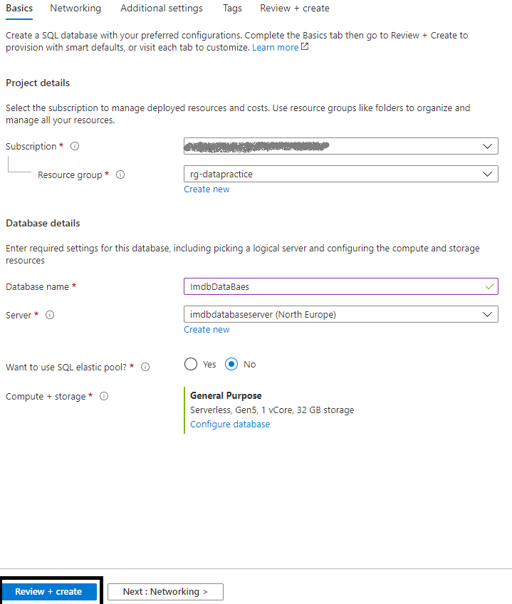
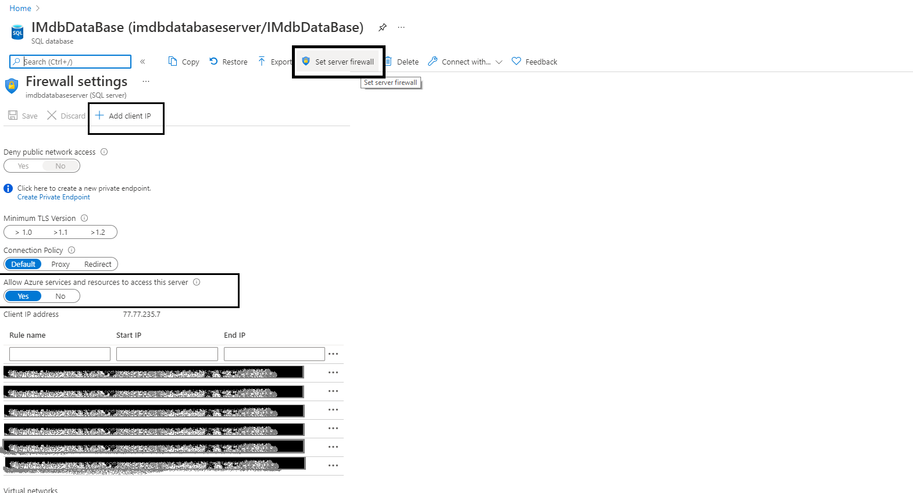
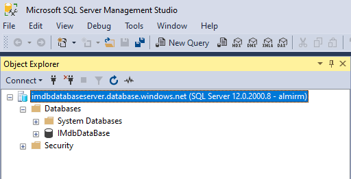

# Set Up Environment

## General overview

Following to project architecture there are several resources we need to create in order to build project.

The first pre-requisit is to have an Azure subscription. If you don't have an Azure subscription, create a [free Azure account](https://azure.microsoft.com/en-us/free/) before you continiue.

After you open Azure Portal under your account the following resourcese need to be created:
1. Azure Storage Account ([see details](#sac))
2. Data Lake Storage Account Gen 2 (ADLS) ([see details](#ADLS))
3. Azure Data Factory ([see details](#ADF))
4. Azure SQL Database ([see details](#SQL))
5. Azure Cosmos DB ([see details](#Cosmos))
6. Azure Databricks Cluster ([see details](#Databricks))
7. Azure Function App (Azure Function) ([see details](#Function))
8. Azure Key Vault ([see details](#KeyVault))

### Final overview of project services
 

**Notice:** *Assuming you are already familiar with all those services no detailed explanation will be provided about each option avaliable within service. For more details please visit Microsoft Docs pages.*

## Storage Account

1.  Click on **+ Create Resource** option on **Azure Home Page**
2.  Type **Storage Account** in Search Box
3.  Click on **Create** (see image below)

4.  On the **Create storage account** page set parameters as shown on screen: \
**Note:** *Location best practice is to set nearest to your location* \
          &nbsp;&nbsp;&nbsp;&nbsp;&nbsp;&nbsp;&nbsp;&nbsp;&nbsp;&nbsp;*For subscription select your subscription* \
          &nbsp;&nbsp;&nbsp;&nbsp;&nbsp;&nbsp;&nbsp;&nbsp;&nbsp;&nbsp;*For **Resource Group** and **Storage name** - keep the same names as on screen for project purpose*
          

5. For **Networking,Data Protection,Advanced and Tags** tabs keep default values
6. On **Review + create** tab review all set parameters and click on **Create** in bottom left corner and wait for resource to be deloyed 

&nbsp;&nbsp;&nbsp;&nbsp;&nbsp;&nbsp;&nbsp;&nbsp;&nbsp;&nbsp;**Note:** *Before click on **Create** be sure that **Validation** status is **passed*** 

7. After Storage Account is created we need to create 3 containers inside the storage account which will be used for different purposes in project. Please see image \

## Data Lake Storage Account
There is only one big difference in creating Azure Data Lake Storage comparing to creating Azure Storage Account. The same is referring to setup of Hierarchical Namespace to **Enabled** (*default is Disabled*) under **Advanced** tab (*please see image below*). All other options remain the same as for Azure Storage Account we created in previous section ([see Azure Account section for details](#sac)) \
\

After Data Lake Storage Account is provisioned, the next we need to do is to create 3 containers type of Blob (*please see image below*)

>### Important recomendation for both Storage Account and Azure Data Lake Storage
>Until now we used Azure portal to create conatiners. It's recomended to use **Azure Storage Explorer** - an application which helps you to easily access the Azure storage account through any device on any platform, be it Windows, MacOS, or Linux. You can easily connect to your subscription and manipulate your tables, blobs, queues, and files. 

After containers are created , using **Azure Storage Explorer** we should see structure as follows:

>Note: For any further activities in project on Azure Blob Storage or ADLS  Azure Storage Explorer will be used

## Azure SQL Database

To provision Azure SQL Database follow these steps:
1.  Click **+ Create a Resource** on Main Azure Portal page
2.  Type **SQL Database** in search box
3.  Click on **Create** after main input form is visible for seting SQL database parameters

4. Set following parameters and click on **Review + Create**

5. Finally, you need to set **Firewall Rules" so you allow other services to access database. After Firewall rules are set test it by trying to connect using Microsoft SQL Management Studio

6. In order to prepare database for the project run the following [script](/SQL%20Server%20Scripts/IMDBDatabaseScript.sql)

## Azure KeyVault

## Azure Data Factory

## Cosmos DB

## Azure Databricks Cluster

## Azure Function App

