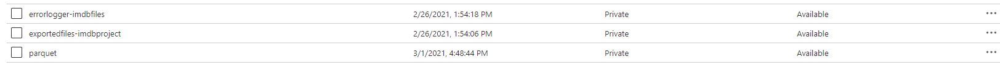

# Set Up Environment

## General overview

Following to project architecture there are several resources we need to create in order to build project.

The first pre-requisit is to have an Azure subscription. If you don't have an Azure subscription, create a [free Azure account](https://azure.microsoft.com/en-us/free/) before you continiue.

After you open Azure Portal under your account the following resourcese need to be created:
1. Azure Storage Account ([see details](#sac))
2. Data Lake Storage Account Gen 2 (ADLS) ([see details](#ADLS))
3. Azure Data Factory ([see details](#ADF))
4. Azure SQL Database ([see details](#SQL))
5. Azure Key Vault ([see details](#KeyVault))
6. Azure Cosmos DB ([see details](#Cosmos))
7. Azure Databricks Cluster ([see details](#Databricks))
8. Azure Function App (Azure Function) ([see details](#Function))

### Final overview of project services
 

>**Notice:** *Assuming you already have solid knowledge and understanding how to provision those services no detailed instructions and screen shoots will be provided on each step of creation. For more details if needed please visit Microsoft Docs pages.*

## Storage Account

For details on how to create Azure Storage Account please visit [this web page](https://docs.microsoft.com/en-us/azure/storage/common/storage-account-create?tabs=azure-portal). 

**Important**: After Azure Storage Account is provisioned, 3 containers must be created as shown on image below. All conatiners are type of Blob Storage and will be used as one of storage solution for the project.

## Data Lake Storage Account

**Notice** : For details on how to create Data Lake Gen 2 Storage please visit [this web page](https://docs.microsoft.com/en-us/azure/storage/blobs/create-data-lake-storage-account).\
*The only difference comparing to Azure Storage Account is in enabling Hierarchy Namespace.*

**Important**: Inside ADLS 3 (three) containers must be created as shown on image below. All conatiners are type of Blob Storage and will be used as one of storage solution for the project.

>### Important recomendation for both Storage Account and Azure Data Lake Storage
>*It's recomended to use **Azure Storage Explorer** - an application which helps you to easily access the Azure storage account through any device on any platform, be it Windows, MacOS, or Linux. You can easily connect to your subscription and manipulate your tables, blobs, queues, and files.*

## Azure SQL Database

After Azure SQL Server is provisioned (for details on how to provision visit [this web page](https://docs.microsoft.com/en-us/learn/modules/provision-azure-sql-db/)), the most important thing is to set firewall rules to allow access to database for other Azure Services and IP addresses/ranges/subnets. For more details on how to set firewall rules please visit [this web page](https://docs.microsoft.com/en-us/azure/azure-sql/database/secure-database-tutorial).

In order to prepare database for the project run the following [script](/SQL%20Server%20Scripts/IMDBDatabaseScript.sql). But first connection to provisioned SQL Server database has to be established. For this we use SQL Server Management Studio. This is also important test if firewall rules are set properly for database access.

## Azure KeyVault
Azure Key Vault is a used for securely storing and accessing secrets (Database Connection strings, Access Keys to storages etc.). 

The process of storing secrets (aka. Access Keys) in Azure Key Vault is generaly straight forward for storage solution such as Storage Account or ADLS. The steps applied are as follows (both for SA and ADLS):
1.  Navigate to **Access key** section for account and copy Access key into notepad
2.  Navigate to Key Valut in resource group and select **Secrets** option on left sidebar
3.  Click on **Generate/Import** and populate required fileds in order to store your secret access keys
4.  After requird fields are populated click on **Create**

The process for storing Connection string for SQL database access is the same only this time we store database connection string instead of access key.

As Azure Data Lake Storage and Azure Databricks are unarguably the backbones of the Azure cloud-based data analytics systems for purpose of secure mounting the storage to Databricks distributed file system (DBFS) it's decided to delegate the Identity and access management tasks to the Azure AD. This is sligthly different approach comparing to previously described steps for ADLS/Storage Account.\
To access resources secured by an Azure AD tenant, a security principal must represent the entity that requires access. A security principal defines the access policy and permissions for a user or an application in the Azure AD tenant. Following steps are required:
1. Register an Azure Application - Find and select Azure Active Directory on the Azure Portal home page. Select **App registrations** and click **+ New registration**
2. On the **Register an application** page, enter the name ADLSAccess and click **Register**

3. In the main screen, copy the Application (client) ID and the Directory (tenant) ID into notepad. Application ID refers to the app we just registered, and the Azure AD tenant our app is registered to is the Directory ID.
4. Next, we need to generate an authentication key  to authenticate the app. Click on **Certificates and secrets**, and then click **+ New client secret**. On the Add a client secret blade, type a description, and expiry of one year, click Add when done. When you click on Add, the client secret (authentication key) will appear. We only have one opportunity to copy this key-value into notepad. It's  not possibble to retrieve it later.
5. Add application secret to the Azure Key Vault (App Id, Client ID and Client Secret)
6. Select **Properties**, copy the **Vault URI** and **Resource ID** to notepad; we will need them in the step when creating secret scope in Azure Databricks
7. Assign ACL to registred app using service principal and Azure Storage Explorer. Open Azure Storage Explorer and navigate to ADLS storage container and right click and select Manage Access Control list and add service principal 

## Azure Data Factory

## Cosmos DB

## Azure Databricks Cluster

## Azure Function App

