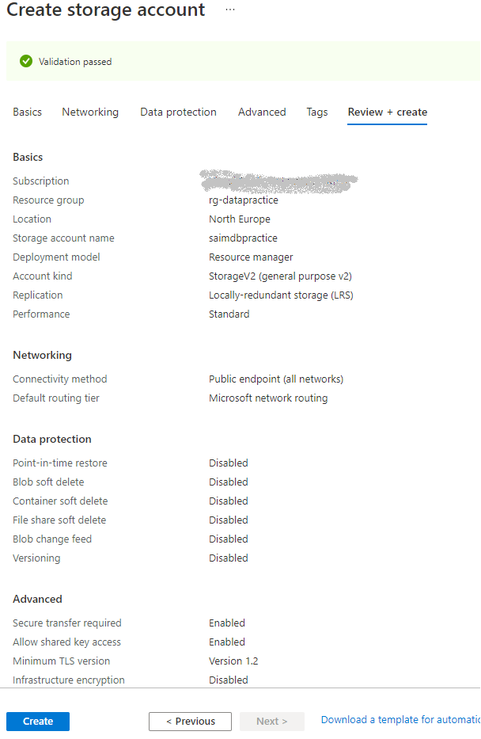

# SetUp Environment

## General overview

Following to project architecture there are several resources we need to create in order to build project.

The first pre-requisit is to have an Azure subscription. If you don't have an Azure subscription, create a [free Azure account](https://azure.microsoft.com/en-us/free/) before you continiue.

After you open Azure Portal under your account the following resourcese need to be created:
1. Azure Storage Account ([see details](#sac))
2. Data Lake Storage Account Gen 2 (ADLS) ([see details](#ADLS))
3. Azure Data Factory ([see details](#ADF))
4. Azure SQL Database ([see details](#SQL))
5. Azure Cosmos DB ([see details](#Cosmos))
6. Azure Databricks Cluster ([see details](#Databricks))
7. Azure Function App (Azure Function) ([see details](#Function))
8. Azure Key Vault ([see details](#KeyVault))

### Final overview of project services
 

**Notice:** *Assuming you are already familiar with all those services no detailed explanation will be provided about each option avaliable within service. For more details please visit Microsoft Docs pages.*

## Storage Account

1.  Click on **+ Create Resource** option on Azure Home Page 
2.  Type **Storage Account** in Search Box
3.  Click on **Create**

4.  On the **Create storage account** page set parameters as shown on screen: \
**Note:** *Location best practice is to set nearest to your location* \
          &nbsp;&nbsp;&nbsp;&nbsp;&nbsp;&nbsp;&nbsp;&nbsp;&nbsp;&nbsp;*For subscription select your subscription* \
          &nbsp;&nbsp;&nbsp;&nbsp;&nbsp;&nbsp;&nbsp;&nbsp;&nbsp;&nbsp;*For **Resource Group** and **Storage name** - keep the same names as on screen for project purpose* \

5. For **Networking,Data Protection,Advanced and Tags** tabs keep default values
6. On **Review + create** tab review all set parameters and click on **Create** in bottom left corner and wait for resource to be deloyed 

&nbsp;&nbsp;&nbsp;&nbsp;&nbsp;&nbsp;&nbsp;&nbsp;&nbsp;&nbsp;**Note:** *Before click on **Create** be sure that **Validation** status is **passed*** 

## Data Lake Storage Account

## Azure Data Factory

## Azure SQL Database

## Cosmos DB

## Azure Databricks Cluster

## Azure Function App

## Azure KeyVault

